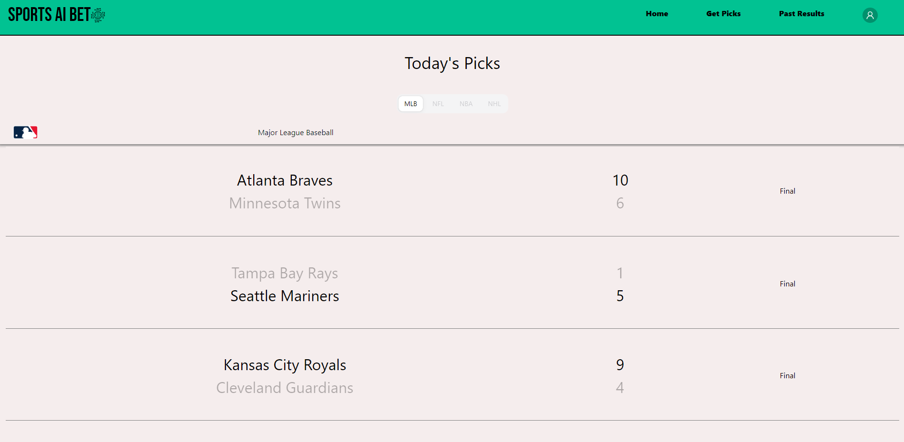
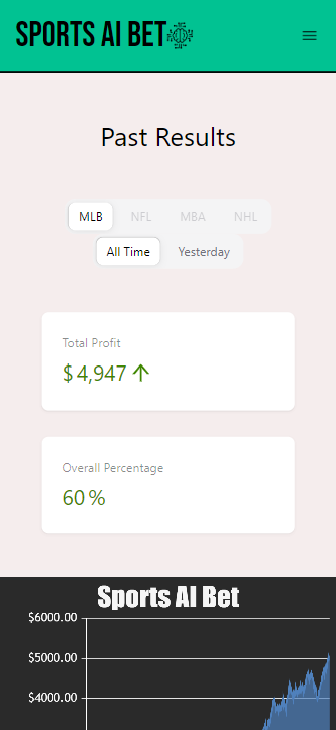

<!-- Improved compatibility of back to top link: See: https://github.com/othneildrew/Best-README-Template/pull/73 -->
<a id="readme-top"></a>
<!--
*** Thanks for checking out the Best-README-Template. If you have a suggestion
*** that would make this better, please fork the repo and create a pull request
*** or simply open an issue with the tag "enhancement".
*** Don't forget to give the project a star!
*** Thanks again! Now go create something AMAZING! :D
-->


<!-- PROJECT SHIELDS -->
<!--
*** I'm using markdown "reference style" links for readability.
*** Reference links are enclosed in brackets [ ] instead of parentheses ( ).
*** See the bottom of this document for the declaration of the reference variables
*** for contributors-url, forks-url, etc. This is an optional, concise syntax you may use.
*** https://www.markdownguide.org/basic-syntax/#reference-style-links
-->
[![LinkedIn][linkedin-shield]][linkedin-url]


<!-- PROJECT LOGO -->
<br />
<div align="center">
  <a href="https://github.com/josephreilly22/sportsaibetapiserver">
    
  </a>

<h3 align="center">Sports AI Bet (API Server)</h3>

  <p align="center">
    This is a piece of a larger Sports AI Bet project. This contains the API portion of the project. This server tranfers data from the database to the front-end. It also allows users to login/create accounts using Google OAuth2.0.
    <br />
    <a href="https://github.com/josephreilly22/sportsaibetapiserver"><strong>Explore the docs »</strong></a>
    <br />
    <br />
    <a href="https://github.com/josephreilly22/sportsaibetapiserver">View Demo</a>
    ·
    <a href="https://github.com/josephreilly22/sportsaibetapiserver">Report Bug</a>
    ·
    <a href="https://github.com/josephreilly22/sportsaibetapiserverd">Request Feature</a>
  </p>
</div>


<!-- TABLE OF CONTENTS -->
<details>
  <summary>Table of Contents</summary>
  <ol>
    <li>
      <a href="#about-the-project">About The Project</a>
      <ul>
        <li><a href="#built-with">Built With</a></li>
      </ul>
    </li>
    <li>
      <a href="#getting-started">Getting Started</a>
      <ul>
        <li><a href="#installation">Installation</a></li>
      </ul>
    </li>
    <li><a href="#roadmap">Roadmap</a></li>
    <li><a href="#license">License</a></li>
    <li><a href="#contact">Contact</a></li>
  </ol>
</details>


<!-- ABOUT THE PROJECT -->
## About The Project

<div display="flex" alignitems="center" justify-content="center">
  
    
</div>


<p align="right">(<a href="#readme-top">back to top</a>)</p>


### Built With

- [ ] ExpressJS
- [ ] Google OAuth2.0 Library


<p align="right">(<a href="#readme-top">back to top</a>)</p>


<!-- GETTING STARTED -->
## Getting Started

This is an example of how you may give instructions on setting up your project locally.
To get a local copy up and running follow these simple example steps.

### Prerequisites

This is an example of how to list things you need to use the software and how to install them.
* npm
  ```sh
  npm install npm@latest -g
  ```

### Installation

1. Check out the repo at https://github.com/josephreilly22/sportsaibetapiserver
2. Clone the repo
   ```sh
   git clone https://github.com/josephreilly22/sportsaibetapiserver
   ```
3. Install NPM packages
   ```sh
   npm install
   ```

<p align="right">(<a href="#readme-top">back to top</a>)</p>


<!-- ROADMAP -->
## Roadmap

- [ ] Server (server.js)
- [ ] MongoDB Database (webdb.js)
- [ ] Retrieving/Updating Data
    - [ ] MLB Data (getMLBData.js)
    - [ ] NFL Data (getNFLData.js)
    - [ ] Other sports coming in the future

See the [open issues](https://github.com/github_username/repo_name/issues) for a full list of proposed features (and known issues).

<p align="right">(<a href="#readme-top">back to top</a>)</p>


<!-- LICENSE -->
## License

Distributed under the Apache License. See `LICENSE.txt` for more information.

<p align="right">(<a href="#readme-top">back to top</a>)</p>


<!-- CONTACT -->
## Contact

Joseph Reilly - joseph2reilly@gmail.com

Project Link: [https://github.com/josephreilly22/sportsapibetaiserver](https://github.com/josephreilly22/sportsaibetapiserver)

<p align="right">(<a href="#readme-top">back to top</a>)</p>


<p align="right">(<a href="#readme-top">back to top</a>)</p>


<!-- MARKDOWN LINKS & IMAGES -->
<!-- https://www.markdownguide.org/basic-syntax/#reference-style-links -->
[license-shield]: https://img.shields.io/github/license/github_username/repo_name.svg?style=for-the-badge
[license-url]: https://github.com/josephreilly22/sportsaibetaiserver/LICENSE
[linkedin-shield]: https://img.shields.io/badge/-LinkedIn-black.svg?style=for-the-badge&logo=linkedin&colorB=555
[linkedin-url]: https://www.linkedin.com/in/joseph-reilly-025055325/
